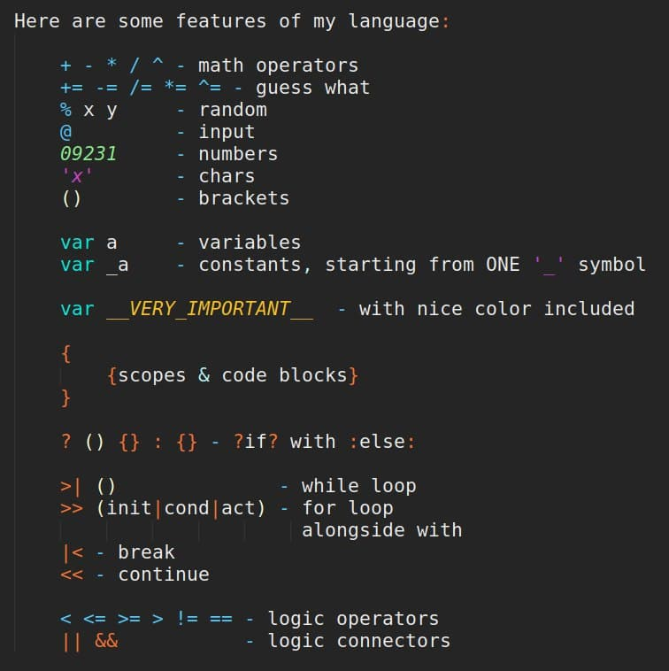
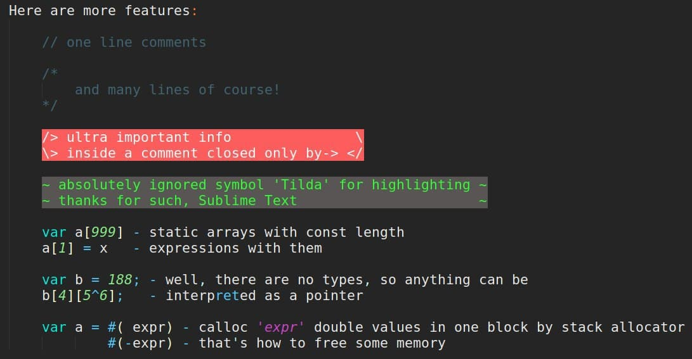
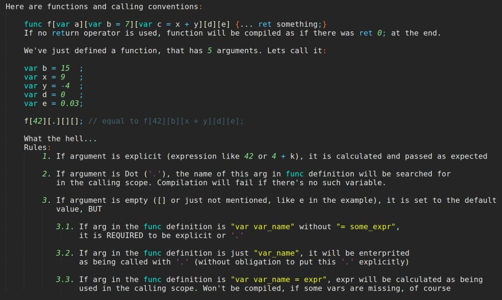
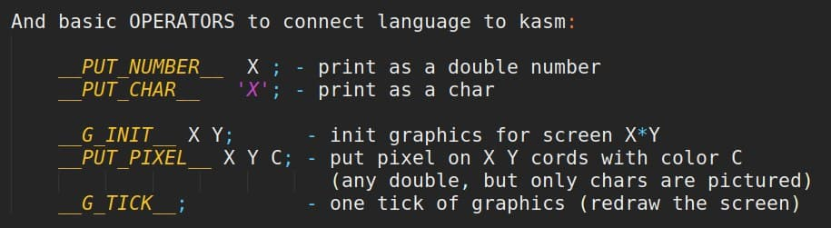

# microContextCompiler
This repository contents a compiler for a programming language named Context into x86 machine code and a small tutorial on how to use it.

# ATTENTITON
The language is made as a joke in term of syntax and some over architecture decisions, so it is meant to be unmanagable to read and undestand

## How to use
Run ```make``` to compiler ```kmcc``` - kMicroContextCompiler that will compile programms into x86
```./kmcc``` to compile ```prog.ctx``` into ```elf```
```./kmcc input_filename``` to compile it into ```elf```
```./kmcc input_filename output_filename``` to get guess what
```


# Context language overview



  

Check out examples of programms in examples folder!

By the way, the first ray-tracer ever written in Context can be found in the repository of [nanoContextCompiler](https://github.com/Magorx/nanoContextCompiler)!
